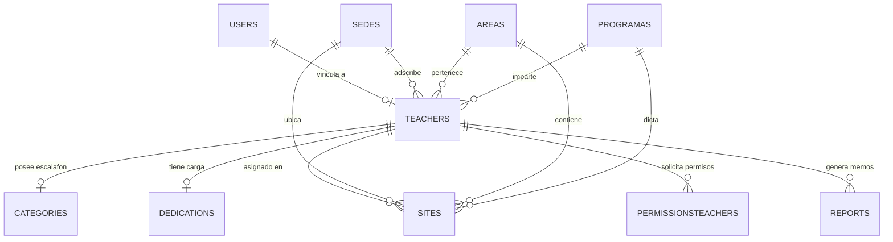

# SIGEDOR - Sistema de Gestión Docente y Reportes

[](https://laravel.com)
[](https://filamentphp.com)
[](https://php.net)
[](LICENSE)
[](https://github.com/frankSousa23/SIGEDOR/releases)
[](https://github.com/frankSousa23/SIGEDOR/actions)
[](https://github.com/frankSousa23/SIGEDOR/actions/workflows/ci.yml)

> **SIGEDOR** es una plataforma web integral desarrollada para la administración digital de expedientes académicos, control de escalafón docente universitario, gestión de carga y dedicación horaria, asignación territorial por sedes/áreas, ingesta de datos por CSV y emisión automatizada de reportes oficiales en PDF con sello criptográfico institucional. Diseñada para la **Universidad Nacional Experimental de los Llanos Centrales Rómulo Gallegos (UNERG)** y liberada a la comunidad bajo la **Licencia MIT**.

---

## 🏛️ Visión Integral del Sistema


---

## 📌 Tabla de Contenidos
- [Características Principales](#-características-principales)
- [Láminas de Presentación y Arquitectura](#-láminas-de-presentación-y-arquitectura-12-láminas)
- [Ingesta de Datos y Carga por CSV](#-ingesta-de-datos-y-carga-por-csv)
- [Roles, Múltiples Roles y Control de Acceso](#-roles-múltiples-roles-y-control-de-acceso)
- [Arquitectura del Sistema](#-arquitectura-del-sistema)
- [Modelo Entidad - Relación](#-modelo-entidad---relación)
- [Requisitos Previos](#-requisitos-previos)
- [Instalación Rápida](#-instalación-rápida)
- [Setup Rápido para Colaboradores](#-setup-rápido-para-colaboradores)
- [Documentación de API y Swagger](#-documentación-de-api-y-swagger)
- [Credenciales Institucionales de Acceso](#-credenciales-institucionales-de-acceso)
- [Ejecución de Pruebas](#-ejecución-de-pruebas)
- [Estructura del Proyecto](#-estructura-del-proyecto)
- [Replicación para Tesis y Proyectos Universitarios](#-replicación-para-tesis-y-proyectos-universitarios)
- [Contribución y Atribución](#-contribución-y-atribución)
- [Licencia](#-licencia)

---

## 🚀 Características Principales

1. **Gestión de Expedientes Docentes:**
   - Registro de datos personales, cédula de identidad, contacto, fecha de ingreso y cátedra asignada.
   - Vinculación institucional con Sedes, Áreas de Conocimiento y Programas académicos.

2. **Control de Escalafón Universitario (Categorías):**
   - Seguimiento cronológico de ascensos docentes: *Instructor, Asistente, Agregado, Asociado y Titular*.
   - Registro de títulos de pregrado y posgrados (Especializaciones, Maestrías, Doctorados).
   - Cálculo automático de categoría vigente y validación de reglas de ascenso.

3. **Dedicación Horaria y Carga Académica:**
   - Modalidades de contratación: *Tiempo Convencional (TCV), Medio Tiempo (MT), Tiempo Completo (TC) y Dedicación Exclusiva (EX)*.
   - Control de horas semanales, asignación de cargos directivos/coordinaciones y atención estudiantil.
   - Unidades de crédito (UC), número de secciones y distribución territorial de cátedras.

4. **Permisos y Licencias Académicas:**
   - Tramitación de años sabáticos, comisiones de servicio, prórrogas, incapacidades y permisos por cuido.
   - Control de vigencias semestrales o anuales con cálculo de fechas y aprobación en panel.

5. **Generación Automatizada de Reportes en PDF:**
   - Constancias de trabajo, expedientes individuales, informes de dedicación y memorandos administrativos vía `barryvdh/laravel-dompdf`.
   - Exportación masiva con soporte para disposición horizontal (landscape) e impresión formal.

6. **Seguridad y Control de Acceso Granular (Multi-Inquilino):**
   - Autenticación estricta: Acceso exclusivo para correos bajo el dominio corporativo `@sigedor.com`.
   - Arquitectura Multi-Sede: El panel de Filament adapta sus consultas (Eloquent Queries) dinámicamente según el rol. Un Administrador posee visión global, mientras que un Jefe de Área solo visualiza y gestiona los registros estrictamente vinculados a su Sede.
   - Control de roles y permisos con `spatie/laravel-permission` (*Administrador, Jefe de Área, Docente*).
   - Panel de administración interactivo potenciado por **Filament v3**.
   - Registro de auditoría y trazabilidad con `spatie/laravel-activitylog`.

7. **Expediente Integral 360° y Sincronización Automática:**
   - Expediente unificado en `TeacherResource` con 4 gestores de relaciones integrados (*Permisos, Escalafón, Carga Horaria y Reportes emitidos*).
   - Sincronización atómica y bidireccional mediante hooks de ciclo de vida Eloquent (`category_id`, `dedication_id`, `site_id`).
   - Códigos de verificación y autenticidad documental institucional (`UNERG-REP-YYYY-XXXX`) embebidos en constancias de trabajo y memorandos oficiales.

8. **Interfaz de Usuario Universal & Responsiva (v2.0.0):**
   - Experiencia multidispositivo fluida desde pantallas móviles compactas (320px) hasta monitores 4K.
   - Navegación optimizada: Barra inferior fija táctil (*Bottom Navigation Bar*) y cajón contextual en móviles; barra lateral colapsable ergonómica en escritorio.
   - Vista dual de expedientes: Modo tabla detallada para auditoría densa y modo cuadrícula de tarjetas táctiles para lectura cómoda en smartphones.
   - Visor documental institucional en hoja A4 estandarizada con código QR de verificación, membrete oficial UNERG e impresión optimizada a PDF.

---

## 🖼️ Láminas de Presentación y Arquitectura (12 Láminas)

El proyecto cuenta con un compendio visual de 12 láminas de arquitectura y defensa de investigación integradas en el repositorio y visualizables tanto en la aplicación interactiva como en formato vectorial SVG:

| N° | Lámina / Tema | Descripción Técnica y Alcance | Vista Previa Vectorial |
| :---: | :--- | :--- | :---: |
| **01** | **SIGEDOR: Portada Oficial** | Motor Digital del Control Académico Universitario. Laravel 11, Filament v3, OpenAPI 3.0 y Licencia MIT. | [Ver Lámina 1](public/images/slides/slide-1.svg) |
| **02** | **Ecosistema Centralizado** | Arquitectura modular alrededor del núcleo Laravel 11: Expedientes, Escalafón, Spatie Multi-Tenant y DomPDF. | [Ver Lámina 2](public/images/slides/slide-2.svg) |
| **03** | **Expediente Integral 360°** | Sincronización atómica garantizada con hooks Eloquent: Adscripción, Escalafón, Carga Horaria y Permisos. | [Ver Lámina 3](public/images/slides/slide-3.svg) |
| **04** | **Reglas de Negocio & Escalafón** | Matriz bidimensional de Categorías (Instructor a Titular) vs. Dedicación (TCV, MT, TC, EX) y validación de posgrados. | [Ver Lámina 4](public/images/slides/slide-4.svg) |
| **05** | **Flujo de Emisión Documental** | Del trámite a la certificación: Solicitud, Aprobación en panel Filament y Generación DomPDF con sello institucional. | [Ver Lámina 5](public/images/slides/slide-5.svg) |
| **06** | **Arquitectura Multi-Inquilino** | Aislamiento territorial con Spatie: Scopes dinámicos por Sede y Área para restringir la visibilidad de expedientes. | [Ver Lámina 6](public/images/slides/slide-6.svg) |
| **07** | **Pipeline de Ingesta Masiva** | Data Factory y Seeders desde archivos planos (`users.csv`, `teachers.csv`, etc.) a persistencia relacional íntegra. | [Ver Lámina 7](public/images/slides/slide-7.svg) |
| **08** | **Arquitectura en Tres Capas** | Separación estricta de responsabilidades: Presentación (Filament/Blade), Lógica (Laravel 11/Spatie) y Datos (MySQL/MariaDB). | [Ver Lámina 8](public/images/slides/slide-8.svg) |
| **09** | **Modelo Relacional (ER)** | Integridad estructural del dominio universitario: Diagrama Entidad-Relación con relaciones 1:1 y 1:N. | [Ver Lámina 9](public/images/slides/slide-9.svg) |
| **10** | **Interoperabilidad & API REST** | Estándar OpenAPI 3.0 con Swagger interactivo para integración con nómina, control de estudios y tableros. | [Ver Lámina 10](public/images/slides/slide-10.svg) |
| **11** | **Fiabilidad y Pruebas Automatizadas** | 49 Pruebas Pasadas y 372 Aserciones al 100% en Pest/PHPUnit, más trazabilidad forense de acciones con ActivityLog. | [Ver Lámina 11](public/images/slides/slide-11.svg) |
| **12** | **Escalabilidad & Código Abierto** | Proyecto nacido como investigación universitaria, desacoplado y liberado bajo Licencia MIT para escalar globalmente. | [Ver Lámina 12](public/images/slides/slide-12.svg) |

---

## 📊 Ingesta de Datos y Carga por CSV

SIGEDOR cuenta con un pipeline de ingesta automatizado mediante archivos CSV estructurados (`database/seeders/data/`):
- `users.csv`: Usuarios, correos, contraseñas hasheadas y asignación de roles.
- `teachers.csv`: Expedientes curriculares y datos demográficos.
- `categories.csv`: Histórico de escalafón y ascensos universitarios.
- `dedications.csv`: Horas semanales, directores y atención estudiantil.
- `sites.csv`: Adscripción curricular por sedes, facultades y materias.

> 📖 Consulta la [Guía Técnica de Importación CSV](docs/csv-data-import-guide.md) para conocer las especificaciones de formato y adaptar tus propios datasets institucionales.

---

## 👥 Roles, Múltiples Roles y Aprobación de Cuentas

El sistema implementa una arquitectura de autorización flexible basada en **Spatie Laravel-Permission**:
- **Soporte Multi-Rol:** Un usuario puede desempeñar varios roles simultáneamente (por ejemplo, ser *Docente* y *Jefe de Área* a la vez).
- **Flujo de Aprobación (`is_approved`):** Las cuentas creadas pueden requerir aprobación explícita de un Administrador antes de acceder al panel.
- **Activación / Desactivación (`is_active`):** El Administrador puede suspender o reactivar cuentas desde la tabla de usuarios con un solo clic.

---

## 🏗 Arquitectura del Sistema


---

## 📊 Modelo Entidad - Relación



---

## ⚙️ Requisitos Previos

- **PHP:** 8.2 o superior (probado en PHP 8.3.x)
- **Extensiones PHP:** `pdo_mysql`, `mbstring`, `openssl`, `curl`, `xml`, `gd`, `zip`, `intl`
- **Base de Datos:** MySQL 8.0+ o MariaDB 10.4+
- **Gestor de Paquetes:** Composer 2.x y Node.js 18+ con NPM

---

## 📦 Instalación Rápida

### 1. Clonar el repositorio
```bash
git clone https://github.com/frankSousa23/SIGEDOR.git
cd SIGEDOR
```

### 2. Instalar dependencias de PHP y Node.js
```bash
composer install
npm install
```

### 3. Configurar variables de entorno
```bash
cp .env.example .env
php artisan key:generate
```

Edita el archivo `.env` para indicar los datos de conexión a tu base de datos:
```ini
DB_CONNECTION=mysql
DB_HOST=127.0.0.1
DB_PORT=3306
DB_DATABASE=sigedor
DB_USERNAME=root
DB_PASSWORD=
```

### 4. Ejecutar migraciones y datos demostrativos (Seeders)
```bash
php artisan migrate:fresh --seed
```

### 5. Compilar assets frontend
```bash
npm run build
```

### 6. Iniciar el servidor local
```bash
php artisan serve
```
El sistema estará accesible en: [http://127.0.0.1:8000](http://127.0.0.1:8000)  
Panel Administrativo: [http://127.0.0.1:8000/admin](http://127.0.0.1:8000/admin)

---

## ⚡ Setup Rápido para Colaboradores

Si deseas clonar y probar SIGEDOR de inmediato en tu entorno local:

```bash
# 1. Clonar e instalar dependencias
git clone https://github.com/frankSousa23/SIGEDOR.git && cd SIGEDOR
composer install
npm install

# 2. Configurar entorno y generar clave
cp .env.example .env
php artisan key:generate

# 3. Base de datos y carga de datos iniciales
php artisan migrate --seed

# 4. Generar documentación Swagger (OpenAPI)
php artisan l5-swagger:generate

# 5. Ejecutar tests para verificar instalación
vendor/bin/pest
```

---

## 📚 Documentación de API y Swagger

SIGEDOR cuenta con una API RESTful documentada bajo la especificación **OpenAPI 3.0 / Swagger** (L5-Swagger) para interoperabilidad con sistemas universitarios (nómina, control de estudios y aplicaciones móviles):

### Endpoints Oficiales (API v1)
- **`GET /api/ping`**: Healthcheck y prueba de disponibilidad operativa. Retorna estado `pong`, marca de tiempo ISO 8601 y versión de especificación `1.0.0`.
- **`GET /api/v1/teachers`**: Catálogo paginado de docentes con relaciones institucionales (sede, área, programa, categoría, dedicación). Admite parámetros opcionales `sede_id` y `page`. Protege la privacidad eliminando datos sensibles (PII) en la capa pública.
- **`GET /api/v1/reports`**: Listado paginado de constancias de trabajo y memorandos oficiales emitidos con su código institucional de verificación criptográfica (`UNERG-REP-YYYY-XXXX`). Admite parámetro opcional `page`.

### Acceso a la Documentación
- **Explorador Interactivo Integrado:** Disponible directamente en la barra superior de la aplicación web haciendo clic en **"API Docs"** (permite probar endpoints en vivo con respuestas HTTP reales).
- **Interfaz Swagger UI (Backend Laravel):** Accesible en `http://localhost:8000/api/documentation` o `/api/documentation`.
- **Regeneración del esquema OpenAPI:**
  ```bash
  php artisan l5-swagger:generate
  ```
> ℹ️ **Nota:** El esquema OpenAPI se genera automáticamente a partir de las anotaciones `@OA` ubicadas en los controladores API (`app/Http/Controllers/Api/`). El archivo `storage/api-docs/api-docs.json` se mantiene versionado y regenerable sin conflictos.

---

## 🔑 Credenciales de Demostración

La base de datos incluye cuentas preconfiguradas con datos sintéticos y anonimizados para pruebas inmediatas:

| Rol | Correo Electrónico | Contraseña | Alcance |
| :--- | :--- | :--- | :--- |
| **Super Administrador** | `admin@sigedor.com` | `password` | Acceso total al panel, gestión de usuarios, roles, sedes, reportes y configuraciones. |
| **Jefe de Área (Sistemas)** | `areamanager@sigedor.com` | `password` | Supervisión y gestión de docentes de su sede y área académica correspondiente. |
| **Jefa de Área (Salud - MultiRol)** | `areamanager.salud@sigedor.com` | `password` | Cuenta con rol de Jefe de Área y Docente asignados simultáneamente. |
| **Docente Académico** | `docente@sigedor.com` | `password` | Consulta de escalafón, dedicación, permisos y reportes personales. |

---

## 🧪 Ejecución de Pruebas

El proyecto cuenta con una suite integral y automatizada de pruebas con **Pest / PHPUnit** (**49 pruebas pasadas con 372 aserciones al 100%**) que valida autenticación, políticas multi-inquilino por Sede/Área, integridad relacional, reglas de negocio de escalafón UNERG, generación de PDFs oficiales y endpoints de la API v1:

```bash
# Ejecutar suite con Pest
./vendor/bin/pest

# O mediante el comando de Artisan
php artisan test
```

---

## 🎓 Replicación para Tesis y Proyectos Universitarios

Si eres estudiante, tesista o desarrollador y deseas utilizar o extender **SIGEDOR** para tu proyecto de grado o institución universitaria:

1. **Estructura Modular:** El código fuente está desacoplado siguiendo principios SOLID, lo que facilita agregar nuevos módulos (evaluaciones docentes, concursos de oposición, posgrados).
2. **Personalización Institucional:** Puedes modificar las Sedes, Áreas y Programas en los seeders y cargar el claustro docente de tu universidad vía CSV.
3. **Generación de Reportes Adaptable:** Las plantillas Blade en `resources/views/pdf/` se pueden personalizar con los membretes, sellos y formatos oficiales de tu universidad.

---

## 📂 Estructura del Proyecto

```
SIGEDOR/
├── app/
│   ├── Filament/          # Paneles, Recursos, Formularios, Tablas y Widgets de Filament v3
│   │   ├── Pages/         # Dashboard personalizado y navegación por roles
│   │   ├── Resources/     # Controladores CRUD de Docentes, Categorías, Sedes, Reportes, etc.
│   │   └── Widgets/       # Widgets de estadísticas y métricas del escritorio
│   ├── Models/            # Modelos Eloquent con relaciones y casts tipados
│   ├── Policies/          # Políticas de autorización Spatie
│   └── Providers/         # Proveedores de servicios (Filament Panel, Auth, etc.)
├── database/
│   ├── factories/         # Factorías sintéticas con Faker para generación de datos
│   ├── migrations/        # 24 migraciones estructuradas
│   └── seeders/           # Semillas con catálogo institucional y datos anonimizados
├── docs/                  # 15 guías de documentación técnica y de arquitectura
├── resources/
│   ├── css/ & js/         # Estilos TailwindCSS y scripts frontend
│   └── views/             # Vistas Blade y plantillas de reportes en PDF
├── routes/                # Rutas web y de consola
└── tests/                 # Pruebas unitarias y de integración
```

---

## 🤝 Contribución y Atribución

Este proyecto es de código abierto. Si utilizas **SIGEDOR** como base para tu propio sistema, investigación o proyecto universitario, por favor añade la debida atribución al autor:

- **Autor Original:** Frank Sousa
- **Repositorio:** [https://github.com/frankSousa23/SIGEDOR](https://github.com/frankSousa23/SIGEDOR)

Las contribuciones mediante Pull Requests son bienvenidas:
1. Haz un Fork del proyecto.
2. Crea una rama para tu feature (`git checkout -b feature/NuevaCaracteristica`).
3. Realiza tus commits (`git commit -m 'feat: Agrega nueva característica'`).
4. Haz push a la rama (`git push origin feature/NuevaCaracteristica`).
5. Abre un Pull Request.

---

## 📄 Licencia

Este proyecto está bajo la Licencia **MIT**. Consulta el archivo [LICENSE](LICENSE) para más detalles.