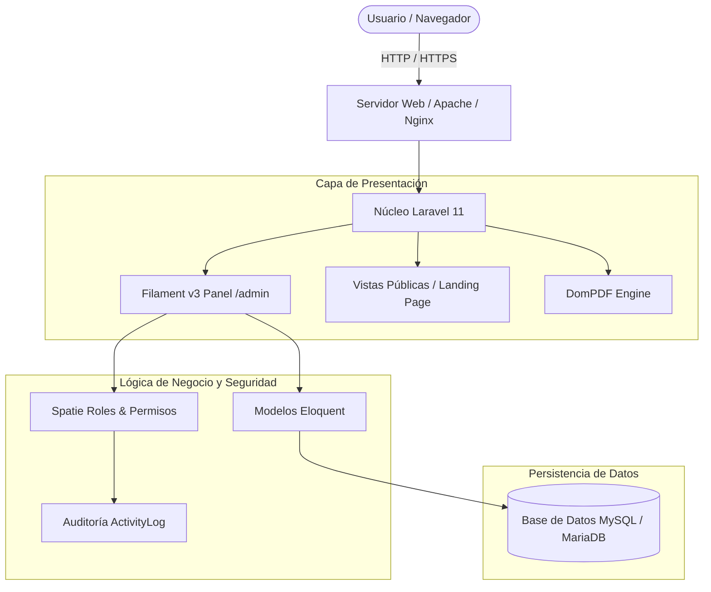
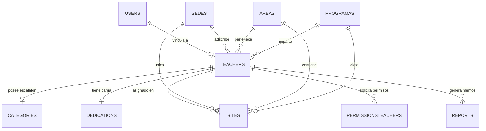

# SIGEDOR - Sistema de Gestión Docente y Reportes

[](https://laravel.com)
[](https://filamentphp.com)
[](https://php.net)
[](LICENSE)
[](#-ejecución-de-pruebas)

> **SIGEDOR** es una plataforma web integral desarrollada originalmente como proyecto de tesis universitaria y liberada a la comunidad bajo la **Licencia MIT**. Diseñada para la administración de expedientes académicos, control de escalafón docente universitario, gestión de carga y dedicación horaria, asignación territorial por sedes/áreas, ingesta de datos por CSV y emisión automatizada de reportes oficiales en PDF.

---

## 📌 Tabla de Contenidos
- [Características Principales](#-características-principales)
- [Ingesta de Datos y Carga por CSV](#-ingesta-de-datos-y-carga-por-csv)
- [Roles, Múltiples Roles y Aprobación de Cuentas](#-roles-múltiples-roles-y-aprobación-de-cuentas)
- [Arquitectura del Sistema](#-arquitectura-del-sistema)
- [Modelo Entidad - Relación](#-modelo-entidad---relación)
- [Requisitos Previos](#-requisitos-previos)
- [Instalación Rápida](#-instalación-rápida)
- [Credenciales de Demostración](#-credenciales-de-demostración)
- [Ejecución de Pruebas](#-ejecución-de-pruebas)
- [Estructura del Proyecto](#-estructura-del-proyecto)
- [Replicación para Tesis y Proyectos Universitarios](#-replicación-para-tesis-y-proyectos-universitarios)
- [Contribución y Atribución](#-contribución-y-atribución)
- [Licencia](#-licencia)

---

## 🚀 Características Principales

1. **Gestión de Expedientes Docentes:**
   - Registro de datos personales, cédula de identidad, contacto, fecha de ingreso y cátedra asignada.
   - Vinculación institucional con Sedes, Áreas de Conocimiento y Programas académicos.

2. **Control de Escalafón Universitario (Categorías):**
   - Seguimiento cronológico de ascensos docentes: *Instructor, Asistente, Agregado, Asociado y Titular*.
   - Registro de títulos de pregrado y posgrados (Especializaciones, Maestrías, Doctorados).
   - Cálculo automático de categoría vigente y validación de reglas de ascenso.

3. **Dedicación Horaria y Carga Académica:**
   - Modalidades de contratación: *Tiempo Convencional (TCV), Medio Tiempo (MT), Tiempo Completo (TC) y Dedicación Exclusiva (EX)*.
   - Control de horas semanales, asignación de cargos directivos/coordinaciones y atención estudiantil.
   - Unidades de crédito (UC), número de secciones y distribución territorial de cátedras.

4. **Permisos y Licencias Académicas:**
   - Tramitación de años sabáticos, comisiones de servicio, prórrogas, incapacidades y permisos por cuido.
   - Control de vigencias semestrales o anuales con cálculo de fechas y aprobación en panel.

5. **Generación Automatizada de Reportes en PDF:**
   - Constancias de trabajo, expedientes individuales, informes de dedicación y memorandos administrativos vía `barryvdh/laravel-dompdf`.
   - Exportación masiva con soporte para disposición horizontal (landscape) e impresión formal.

6. **Seguridad y Control de Acceso Granular:**
   - Control de roles y permisos con `spatie/laravel-permission` (*Administrador, Jefe de Área, Docente*).
   - Panel de administración interactivo potenciado por **Filament v3**.
   - Registro de auditoría y trazabilidad con `spatie/laravel-activitylog`.

---

## 📊 Ingesta de Datos y Carga por CSV

SIGEDOR cuenta con un pipeline de ingesta automatizado mediante archivos CSV estructurados (`database/seeders/data/`):
- `users.csv`: Usuarios, correos, contraseñas hasheadas y asignación de roles.
- `teachers.csv`: Expedientes curriculares y datos demográficos.
- `categories.csv`: Histórico de escalafón y ascensos universitarios.
- `dedications.csv`: Horas semanales, directores y atención estudiantil.
- `sites.csv`: Adscripción curricular por sedes, facultades y materias.

> 📖 Consulta la [Guía Técnica de Importación CSV](docs/csv-data-import-guide.md) para conocer las especificaciones de formato y adaptar tus propios datasets institucionales.

---

## 👥 Roles, Múltiples Roles y Aprobación de Cuentas

El sistema implementa una arquitectura de autorización flexible basada en **Spatie Laravel-Permission**:
- **Soporte Multi-Rol:** Un usuario puede desempeñar varios roles simultáneamente (por ejemplo, ser *Docente* y *Jefe de Área* a la vez).
- **Flujo de Aprobación (`is_approved`):** Las cuentas creadas pueden requerir aprobación explícita de un Administrador antes de acceder al panel.
- **Activación / Desactivación (`is_active`):** El Administrador puede suspender o reactivar cuentas desde la tabla de usuarios con un solo clic.

---

## 🏗 Arquitectura del Sistema



---

## 📊 Modelo Entidad - Relación



---

## ⚙️ Requisitos Previos

- **PHP:** 8.2 o superior (probado en PHP 8.3.x)
- **Extensiones PHP:** `pdo_mysql`, `mbstring`, `openssl`, `curl`, `xml`, `gd`, `zip`, `intl`
- **Base de Datos:** MySQL 8.0+ o MariaDB 10.4+
- **Gestor de Paquetes:** Composer 2.x y Node.js 18+ con NPM

---

## 📦 Instalación Rápida

### 1. Clonar el repositorio
```bash
git clone https://github.com/frankSousa23/SIGEDOR.git
cd SIGEDOR
```

### 2. Instalar dependencias de PHP y Node.js
```bash
composer install
npm install
```

### 3. Configurar variables de entorno
```bash
cp .env.example .env
php artisan key:generate
```

Edita el archivo `.env` para indicar los datos de conexión a tu base de datos:
```ini
DB_CONNECTION=mysql
DB_HOST=127.0.0.1
DB_PORT=3306
DB_DATABASE=sigedor
DB_USERNAME=root
DB_PASSWORD=
```

### 4. Ejecutar migraciones y datos demostrativos (Seeders)
```bash
php artisan migrate:fresh --seed
```

### 5. Compilar assets frontend
```bash
npm run build
```

### 6. Iniciar el servidor local
```bash
php artisan serve
```
El sistema estará accesible en: [http://127.0.0.1:8000](http://127.0.0.1:8000)  
Panel Administrativo: [http://127.0.0.1:8000/admin](http://127.0.0.1:8000/admin)

---

## 🔑 Credenciales de Demostración

La base de datos incluye cuentas preconfiguradas con datos sintéticos y anonimizados para pruebas inmediatas:

| Rol | Correo Electrónico | Contraseña | Alcance |
| :--- | :--- | :--- | :--- |
| **Super Administrador** | `admin@sigedor.com` | `password` | Acceso total al panel, gestión de usuarios, roles, sedes, reportes y configuraciones. |
| **Jefe de Área (Sistemas)** | `areamanager@sigedor.com` | `password` | Supervisión y gestión de docentes de su sede y área académica correspondiente. |
| **Jefa de Área (Salud - MultiRol)** | `areamanager.salud@sigedor.com` | `password` | Cuenta con rol de Jefe de Área y Docente asignados simultáneamente. |
| **Docente Académico** | `docente@sigedor.com` | `password` | Consulta de escalafón, dedicación, permisos y reportes personales. |

---

## 🧪 Ejecución de Pruebas

El proyecto cuenta con una suite automatizada de pruebas con **Pest / PHPUnit** que valida autenticación, permisos, integridad relacional, reglas de negocio y cálculo de escalafón:

```bash
php artisan test
```

---

## 🎓 Replicación para Tesis y Proyectos Universitarios

Si eres estudiante, tesista o desarrollador y deseas utilizar o extender **SIGEDOR** para tu proyecto de grado o institución universitaria:

1. **Estructura Modular:** El código fuente está desacoplado siguiendo principios SOLID, lo que facilita agregar nuevos módulos (evaluaciones docentes, concursos de oposición, posgrados).
2. **Personalización Institucional:** Puedes modificar las Sedes, Áreas y Programas en los seeders y cargar el claustro docente de tu universidad vía CSV.
3. **Generación de Reportes Adaptable:** Las plantillas Blade en `resources/views/pdf/` se pueden personalizar con los membretes, sellos y formatos oficiales de tu universidad.

---

## 📂 Estructura del Proyecto

```
SIGEDOR/
├── app/
│   ├── Filament/          # Paneles, Recursos, Formularios, Tablas y Widgets de Filament v3
│   │   ├── Pages/         # Dashboard personalizado y navegación por roles
│   │   ├── Resources/     # Controladores CRUD de Docentes, Categorías, Sedes, Reportes, etc.
│   │   └── Widgets/       # Widgets de estadísticas y métricas del escritorio
│   ├── Models/            # Modelos Eloquent con relaciones y casts tipados
│   ├── Policies/          # Políticas de autorización Spatie
│   └── Providers/         # Proveedores de servicios (Filament Panel, Auth, etc.)
├── database/
│   ├── factories/         # Factorías sintéticas con Faker para generación de datos
│   ├── migrations/        # 20 migraciones estructuradas
│   └── seeders/           # Semillas con catálogo institucional y datos anonimizados
├── docs/                  # 12 guías de documentación técnica y de arquitectura
├── resources/
│   ├── css/ & js/         # Estilos TailwindCSS y scripts frontend
│   └── views/             # Vistas Blade y plantillas de reportes en PDF
├── routes/                # Rutas web y de consola
└── tests/                 # Pruebas unitarias y de integración
```

---

## 🤝 Contribución y Atribución

Este proyecto es de código abierto. Si utilizas **SIGEDOR** como base para tu propio sistema, investigación o proyecto universitario, por favor añade la debida atribución al autor:

- **Autor Original:** Frank Sousa
- **Repositorio:** [https://github.com/frankSousa23/SIGEDOR](https://github.com/frankSousa23/SIGEDOR)

Las contribuciones mediante Pull Requests son bienvenidas:
1. Haz un Fork del proyecto.
2. Crea una rama para tu feature (`git checkout -b feature/NuevaCaracteristica`).
3. Realiza tus commits (`git commit -m 'feat: Agrega nueva característica'`).
4. Haz push a la rama (`git push origin feature/NuevaCaracteristica`).
5. Abre un Pull Request.

---

## 📄 Licencia

Este proyecto está bajo la Licencia **MIT**. Consulta el archivo [LICENSE](LICENSE) para más detalles.