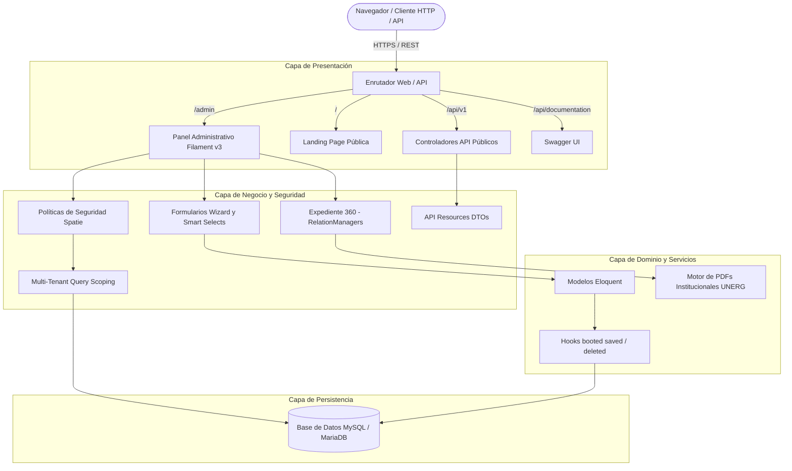

# Arquitectura Técnica del Sistema SIGEDOR

SIGEDOR está diseñado bajo una arquitectura modular y orientada a dominios académicos sobre el ecosistema moderno de **Laravel 11.x** y **Filament v3**, garantizando alta cohesión, desacoplamiento y cumplimiento estricto de los principios SOLID.

---

## 1. Stack Tecnológico

- **Framework Núcleo**: Laravel 11.x (PHP 8.2+ / 8.3+)
- **Panel Administrativo**: Filament v3 (Livewire 3, Alpine.js, Tailwind CSS)
- **Gestión de Identidad y Roles**: Spatie Laravel-Permission v6
- **Motor de Renderizado Documental**: DomPDF (`barryvdh/laravel-dompdf`)
- **Documentación de API**: L5-Swagger (OpenAPI 3.0 / Swagger UI)
- **Base de Datos**: MySQL 8.0+ / MariaDB 10.4+ (SQLite para testing en memoria)
- **Auditoría y Trazabilidad**: Spatie Laravel-Activitylog

---

## 2. Diagrama de Capas del Sistema

---

## 3. Principios de Diseño y Patrones Arquitecturales

1. **Multi-Tenant Query Scoping**:
   - Cada recurso en Filament sobreescribe `getEloquentQuery()` para aplicar aislamiento territorial dinámico:
     - El rol `admin` obtiene acceso irrestricto a todas las sedes.
     - El rol `area_manager` ve acotada su consulta a los docentes y reportes de su propia sede.
     - El rol `teacher` solo accede a su registro personal.
2. **Sincronización Reactiva por Ciclo de Vida (Observer / Hooks Pattern)**:
   - En lugar de complejas llamadas distribuidas, los modelos `Category`, `Dedication` y `Site` emplean hooks `booted()` (`saved` y `deleted`) para mantener las claves foráneas de `Teacher` actualizadas automáticamente.
3. **Data Transfer Objects (DTO) en API**:
   - `TeacherPublicResource` y `ReportPublicResource` garantizan que ningún dato personal sensible (teléfonos, fechas de nacimiento, claves de usuario) sea expuesto a consumidores externos no autorizados.
4. **Segregación de Interfaces (ISP)**:
   - Los formularios extensos se estructuran en asistentes por pasos (*Wizards*) y gestores de relaciones modulares (*RelationManagers*), dividiendo la responsabilidad de cada vista.
