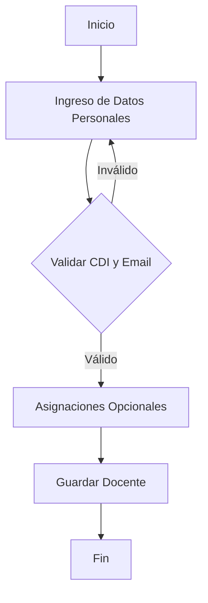
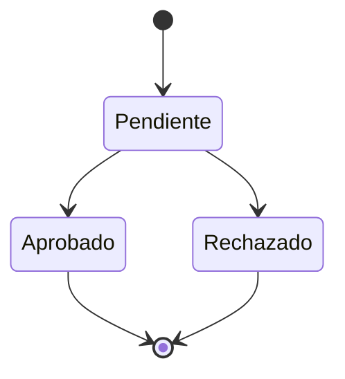
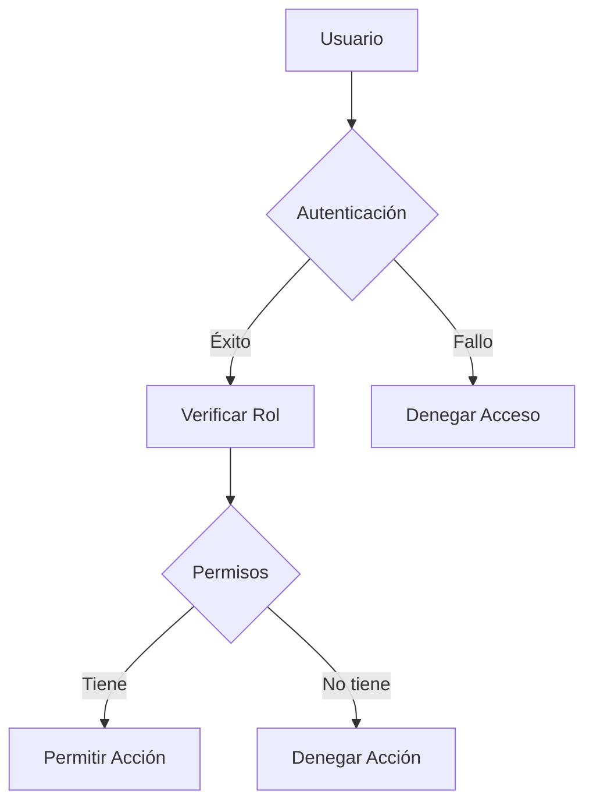

# Flujo del Sistema

## 1. Registro de Docentes

### Proceso de Registro
1. Ingreso de datos personales
   - CDI (único)
   - Correo electrónico (único)
   - Nombre y apellido
   - Información de contacto

2. Asignaciones opcionales
   - Sede
   - Categoría
   - Dedicación

3. Validaciones
   - Verificación de unicidad
   - Validación de formato
   - Comprobación de relaciones

### Diagrama de Flujo


## 2. Gestión de Asignaciones

### Asignación de Sede
1. Selección de sede disponible
2. Verificación de cupos
3. Actualización de registros

### Asignación de Categoría
1. Verificación de requisitos
2. Selección de categoría
3. Registro de promoción

### Asignación de Dedicación
1. Verificación de disponibilidad
2. Selección de tipo
3. Cálculo de horas

## 3. Control de Permisos

### Solicitud de Permiso
1. Ingreso de solicitud
   - Fechas
   - Motivo
   - Documentación

2. Proceso de aprobación
   - Revisión
   - Aprobación/Rechazo
   - Notificación

### Estados de Permiso
- Pendiente
- Aprobado
- Rechazado

### Diagrama de Estados


## 4. Reportes y Seguimiento

### Tipos de Reportes
1. Individuales
   - Historial docente
   - Permisos
   - Asignaciones

2. Por Sede
   - Distribución docente
   - Carga horaria
   - Estadísticas

3. Por Categoría
   - Distribución
   - Promociones
   - Requisitos

### Generación de Reportes
1. Selección de tipo
2. Filtros aplicables
3. Formato de salida
   - PDF
   - Excel
   - Web

## 5. Mantenimiento de Catálogos

### Sedes
1. Registro
2. Actualización
3. Desactivación

### Categorías
1. Creación
2. Modificación requisitos
3. Gestión niveles

### Dedicaciones
1. Definición tipos
2. Actualización horas
3. Control asignaciones

## 6. Gestión de Usuarios

### Roles del Sistema
1. Administrador
   - Acceso total
   - Gestión usuarios
   - Configuración

2. Supervisor
   - Aprobación permisos
   - Reportes
   - Seguimiento

3. Operador
   - Registro docentes
   - Actualización datos
   - Reportes básicos

### Control de Acceso


## 7. Notificaciones

### Tipos
1. Sistema
   - Errores
   - Advertencias
   - Información

2. Usuario
   - Aprobaciones
   - Rechazos
   - Recordatorios

### Canales
- Email
- Sistema interno
- Dashboard

## 8. Auditoría

### Eventos Registrados
1. Accesos
   - Login/Logout
   - Intentos fallidos
   - Cambios contraseña

2. Operaciones
   - Creación
   - Modificación
   - Eliminación

3. Permisos
   - Solicitudes
   - Aprobaciones
   - Rechazos

### Registro de Auditoría
```sql
CREATE TABLE audit_logs (
    id bigint PRIMARY KEY,
    user_id bigint,
    action varchar(255),
    model_type varchar(255),
    model_id bigint,
    old_values json,
    new_values json,
    created_at timestamp
);
```

## 9. Respaldo y Recuperación

### Respaldo
1. Datos
   - Base de datos
   - Archivos
   - Configuración

2. Frecuencia
   - Diario
   - Semanal
   - Mensual

### Recuperación
1. Punto de restauración
2. Verificación integridad
3. Pruebas post-recuperación

## 10. Integración

### APIs Disponibles
1. Consulta
   - Docentes
   - Asignaciones
   - Permisos

2. Gestión
   - Registro
   - Actualización
   - Eliminación

### Formatos
- JSON
- XML
- CSV

## Notas de Implementación

1. Seguridad
   - Autenticación robusta
   - Autorización por roles
   - Registro de actividades

2. Rendimiento
   - Cache de consultas
   - Optimización queries
   - Índices efectivos

3. Mantenibilidad
   - Código documentado
   - Pruebas unitarias
   - Control versiones
